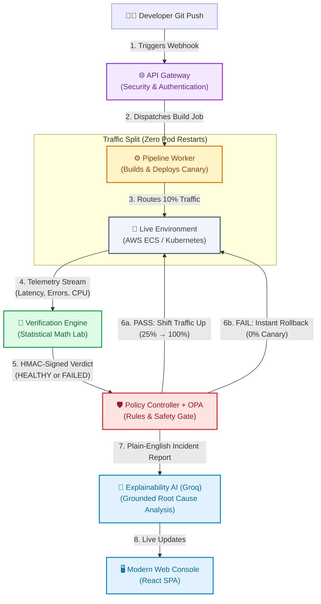
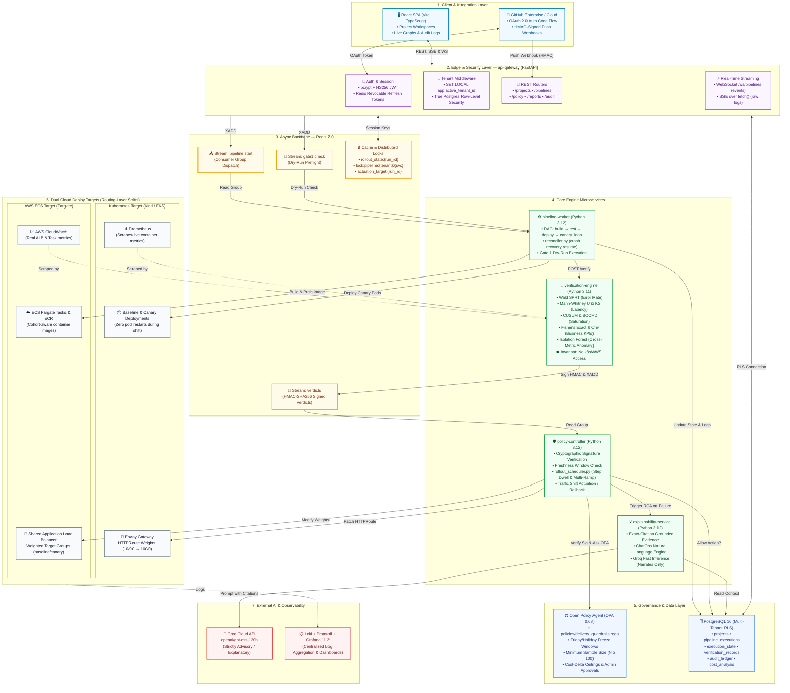
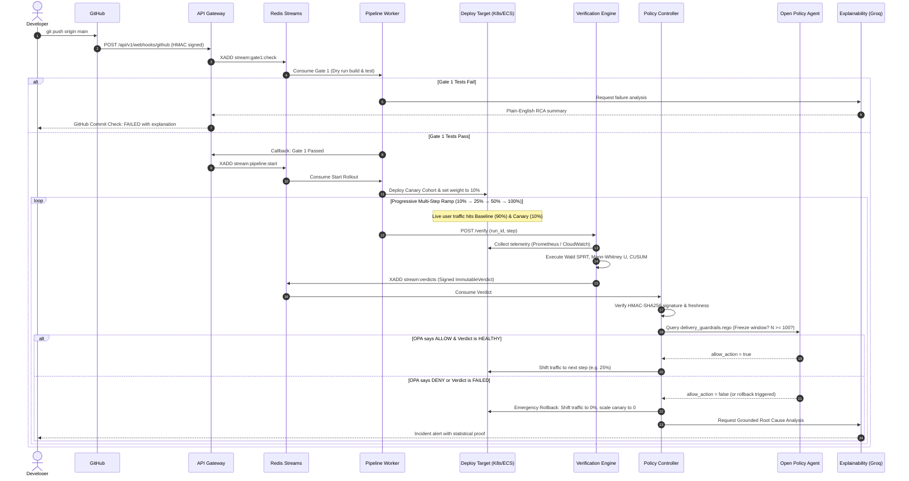

# Smart AI DevOps Platform — System Architecture Visual Guide

> **Core Philosophy**: Most CI/CD systems deploy blindly and wait for human alerts. This platform functions like an **automated flight control tower**: it deploys a canary alongside production, uses genuine statistical tests to evaluate live behavior at incremental steps (10% → 25% → 50% → 100%), cryptographically signs every verdict, gates every action through OPA policy, and rolls back automatically before human customers ever notice an issue.

---

## 1. Executive Summary & Plain-English Analogy

```
   Traditional Deployment (Blind Drop)                 This Platform (Self-Verifying Canary)
   ───────────────────────────────────                 ─────────────────────────────────────
   Deploy 100% ──▶ Hope it doesn't crash               Deploy 10% ──▶ Test Statistics ──▶ Pass?
         │                                                    │                              │
         ▼                                                    ▼                              ▼
   Users complain ──▶ 3 AM PagerDuty call              Rollback in ms              Promote to 25%... 100%
```

Imagine an **Automated High-Speed Railway Switch**:
1. **The Code Train Arrives (GitHub)**: A developer pushes code.
2. **The Pre-Boarding Inspection (Gate 1)**: The system dry-runs and builds the code in an isolated sandbox. If it fails, an AI engineer explains why in plain English.
3. **The Test Track (Canary Deployment)**: 10% of real passenger traffic is routed to the new train, while 90% stays on the proven baseline.
4. **The Science Lab (Verification Engine)**: Sensors measure passenger satisfaction, braking distance, and engine heat. Instead of asking a simple question like *"is temperature > 80°?"*, mathematical algorithms compare the canary against the baseline distribution.
5. **The Safety Inspector (Policy Controller + OPA)**: Verifies the lab's official wax seal (HMAC signature) and checks company safety bylaws (freeze windows, budget limits).
6. **The Switch Actuation**: If healthy, the track gradually shifts to 25%, 50%, and finally 100%. If any anomaly is detected, traffic switches back to 0% in milliseconds with zero downtime.

---

## 2. High-Level Visual Flow (Non-Technical View)



---

## 3. End-to-End System Architecture (Detailed Technical Map)

This diagram preserves **100% of the nodes, queues, databases, and microservices** from `System_architecture.pdf` while organizing them into clean functional zones:



---

## 4. The 5 Core Invariants: Bridge from Tech to Business Value

| # | Technical Invariant | Plain-English Meaning | Business Value / Disaster Prevented |
|---|---|---|---|
| **1** | **No Static Thresholds**<br>(Wald SPRT, Mann-Whitney U, CUSUM/BOCPD) | Never check `if error > 1%`. Instead, compare canary probability curves to baseline curves. | **Prevents False Positives & False Negatives**: A 2% error rate at 3 AM might be random jitter, but at peak hours it is a disaster. Math handles the difference automatically. |
| **2** | **Routing-Layer Traffic Shifting**<br>(Gateway API HTTPRoute / ALB Listener Rules) | We move the road signs (traffic weight), we never stop and restart the cars (pods/tasks). | **Zero Downtime & Instant Rollbacks**: Pod restarts cause cold-start latency spikes. Routing shifts occur in ~20ms with no service interruption. |
| **3** | **Cryptographic Verdict Signatures**<br>(HMAC-SHA256 + Freshness Window) | The math engine stamps verdicts with a secret tamper-proof wax seal. The controller rejects unsigned verdicts. | **Zero Rogue Deployments**: Prevents compromised workers, rogue scripts, or network replay attacks from forcing an untested deployment live. |
| **4** | **Multi-Tenancy Postgres RLS**<br>(`SET LOCAL app.active_tenant_id`) | Database rows are physically invisible across tenants at the SQL engine level. | **Complete Data Privacy**: A bug in the application code can never leak customer A’s audit logs or deployment configurations to customer B. |
| **5** | **Strict Statistical Floor**<br>($N \ge 100$ enforced in Python & OPA) | No verdict can promote a release without at least 100 real requests observed. | **Prevents Premature Promotion**: Prevents rolling out broken code to 100% of users based on 2 lucky test requests. |

---

## 5. Life of a Code Change (Chronological Sequence)



---

## 6. How the Statistical Algorithms Work (Non-Math Summary)

```
┌─────────────────────────┬───────────────────────────────────┬──────────────────────────────────────────┐
│ Verification Test       │ What It Looks At                  │ Everyday Intuition                       │
├─────────────────────────┼───────────────────────────────────┼──────────────────────────────────────────┤
│ Wald SPRT               │ Failed vs. Successful requests    │ Like flipping a coin repeatedly to       │
│ (Sequential Ratio Test) │ over time                         │ decide whether it's rigged without       │
│                         │                                   │ needing 10,000 flips first.              │
├─────────────────────────┼───────────────────────────────────┼──────────────────────────────────────────┤
│ Mann-Whitney U          │ Full response time curve          │ Compares the full distribution of        │
│                         │ (p50, p95, p99)                   │ speeds, so a few slow outliers don't     │
│                         │                                   │ fool the system into a false alarm.      │
├─────────────────────────┼───────────────────────────────────┼──────────────────────────────────────────┤
│ CUSUM + BOCPD           │ Memory & CPU consumption          │ Detects subtle gradual leaks (like a     │
│ (Changepoint Detection) │ trends                            │ dripping pipe) before the water tank     │
│                         │                                   │ completely overflows.                    │
├─────────────────────────┼───────────────────────────────────┼──────────────────────────────────────────┤
│ Fisher's Exact / Chi²   │ Real business conversions         │ Guarantees that users are still able to  │
│                         │ (e.g. checkout click %)           │ complete purchases at the same rate      │
│                         │                                   │ as before the deployment.                │
├─────────────────────────┼───────────────────────────────────┼──────────────────────────────────────────┤
│ Isolation Forest        │ Cross-metric relationship         │ An AI scout that detects weird combinations│
│                         │ (e.g. CPU low but latency high)   │ that look normal in isolation.           │
└─────────────────────────┴───────────────────────────────────┴──────────────────────────────────────────┘
```

---

## 7. Dual Deployment Targets: Kubernetes vs. AWS ECS

The platform abstracts deployment so the same verification and policy engine controls both:

1. **Local & High-Control (Kubernetes / Kind)**:
   - Uses Gateway API `HTTPRoute` rules.
   - Traffic splits are handled by **Envoy Gateway**.
   - Telemetry is scraped in sub-seconds via **Prometheus**.
2. **Production Cloud (AWS ECS Fargate)**:
   - Uses a **single shared Application Load Balancer (ALB)** across all projects to minimize AWS cost.
   - Traffic splits are executed by adjusting listener rule target group weights.
   - Telemetry is queried via **AWS CloudWatch**.
   - Builds push directly to **Amazon ECR**.

---

## 8. Summary of Architectural Achievements

- **True Zero-Downtime Autonomous Rollouts**: Real multi-step progression (10% → 25% → 50% → 100%) with automatic pause for platform-admin manual approval at 100% cutover.
- **Fail-Soft Self-Healing**: If any worker crashes, `reconciler.py` automatically picks up the interrupted stage from PostgreSQL upon reboot without duplicate executions.
- **Explainable AI with Grounded Guardrails**: LLMs are never allowed to make deployment decisions; they only narrate and analyze mathematical evidence after the fact.
